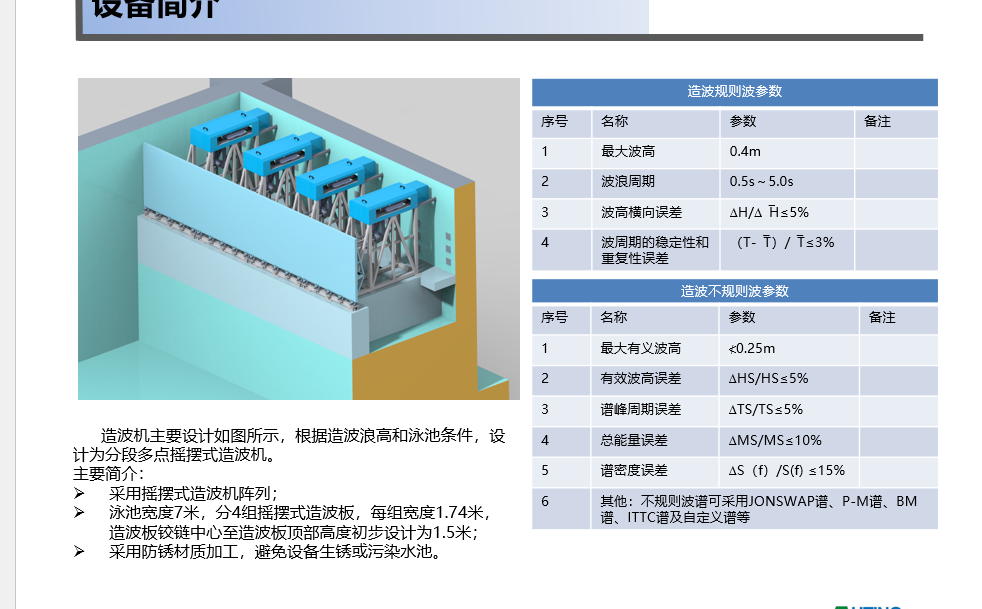
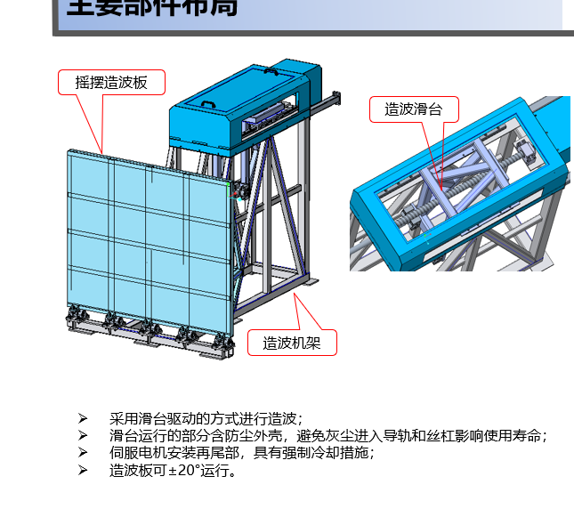

# 造波计算讨论记录

记录日期：2026-09-30。

## 用户目标与范围

用户希望计算造波点位，让实际水面在指定测点形成与目标一致的波形。本次讨论解释计算方法，尚未授权修改自动造波控制逻辑。

“波形一致”需要区分：波高和周期一致、频谱及统计特征一致、逐时刻波峰波谷一致。后者还需要各频率的相位和时间同步。验收应明确测点位置，不能默认整个水槽各处具有相同的时间序列。

## 已核对的项目现状

- `Wave/Generation/WaveMakerWaveGenerator.cs` 的内置算法生成水面高程，CSV 表头为 `TimeSeconds,ElevationMetres`；线性规则波计算为 `H / 2 * cos(omega * t)`。
- 内置算法尚未实现目标水面高程到造波板运动的转换，不能直接把高程当作 PLC 位移或角度下发。
- `Wave/Legacy/LegacyWaveSignal.cs` 将旧格式文件读取为造波板位移，按毫米处理；拒绝将 `ElevationMetres` 文件作为旧造波板位移文件。
- 旧程序内部如何计算造波转换尚未确认，不能假定其输出已对当前设备完成实测标定。
- 现有手动轴服务默认显示角度，不足以确认 PLC 点位实际单位或机械传动关系。

## 用户已确认的设备结构

用户于 2026-09-30 补充：结构为摇板式，上方使用电机丝杆驱动。

- 按摇板／摆板造波机构考虑水动力转换，不采用平推板模型。
- 驱动链路按“电机 → 丝杆滑台 → 连接机构 → 摇板”理解。用户提供的示意图显示板下部铰接；实际连接尺寸和铰链相对池底的位置仍待确认。
- 上方有丝杆不代表铰链一定在水槽底部，也不代表丝杆位移等于摇板在静水面处的水平位移。
- 点位计算需要经过“目标水面高程 → 摇板摆角 → 丝杆位置 → PLC 轴点位”。若 PLC 内部已经完成机械换算，应按其轴单位处理，避免重复换算。
- 原理论示例采用底部铰接，仍只是示例，不能据此认定当前设备满足该几何条件。

丝杆到摇板的转换应依据侧面结构图，建立以中位为参考的 `u = F(theta)`；不能在未知连接结构时默认 `u = L * sin(theta)`。

若 PLC 点位为电机角度，且丝杆导程为 `p` mm/转、传动比定义为 `i = 电机转数 / 丝杆转数`，则相对中位的丝杆位移 `u` mm 对应：

```text
motorAngleDegrees = 360 * i * u / p
```

运动正方向、中位偏置及实际轴缩放仍需核对。若 PLC 已使用丝杆毫米作为工程单位，无需再次按导程转换。

## 用户提供的设备资料

用户于 2026-09-30 提供设备简介及主要部件布局截图。以下是资料中的设计描述及指标，不代表已完成现场性能验收，也不应直接转成 PLC 配置。

| 项目 | 资料内容 |
|---|---|
| 设备类型 | 分段多点摇摆式造波机阵列 |
| 水池宽度 | 7 m |
| 造波板数量 | 4 组 |
| 每组宽度 | 1.74 m |
| 铰链中心到板顶的高度 | 初步设计 1.5 m |
| 驱动形式 | 滑台驱动，上方电机丝杆；资料另注明伺服电机安装于尾部，有强制冷却措施 |
| 板允许摆动范围 | ±20° |
| 规则波最大波高 | 0.4 m |
| 规则波周期范围 | 0.5–5.0 s |
| 规则波波高误差指标 | ≤5% |
| 规则波周期稳定性及重复性误差指标 | ≤3% |
| 不规则波最大有效波高 | <0.25 m |
| 不规则波有效波高误差指标 | ≤5% |
| 不规则波谱峰周期误差指标 | ≤5% |
| 不规则波总能量误差指标 | ≤10% |
| 不规则波谱密度误差指标 | ≤15% |
| 资料列出的波谱 | JONSWAP、P-M、BM、ITTC、自定义谱 |

资料还描述采用防锈材质，滑台运动部分有防尘外壳，以避免灰尘进入导轨和丝杆。

使用这些资料时必须区分：

- 1.5 m 是铰链中心到板顶的初步设计高度，不是水深，不是铰链到静水面的距离，也不是已经确认的驱动连接力臂。
- ±20° 是资料中的板角度范围，不是电机角度或丝杆行程；仍要核对中位、方向及实际轴缩放。
- 最大波高和周期范围不代表所有组合都可实现，需结合水深、行程、速度、加速度及实测工作范围确认。
- 4 组板的精确中心位置、同步方式和边界条件未给出，不能仅凭总池宽确定各轴相位。
- 当前图片说明结构类型，但不足以唯一确定 `u = F(theta)`。仍需要尺寸侧视图或实际角度与轴位置的标定数据。

原始截图已保存，供后续核对：





## 计算方法

### 规则波

目标高程：`eta(t) = H / 2 * cos(omega * t + phi)`。

- `H` 为波峰到波谷的波高，振幅为 `H / 2`。
- `omega = 2 * pi / T`。
- 根据水深 `h` 求波数 `k`：`omega^2 = g * k * tanh(k * h)`。
- 定义 `K = H / S`，其中 `S` 为造波板在静水面处的全行程，则 `S = H / K`。
- `K` 取决于频率、水深和板的运动形式，不能对所有频率使用同一个倍率。

底部铰接摆板、小振幅线性理论下，令 `q = k * h`：

```text
K = 4 * sinh(q) * (1 + q * sinh(q) - cosh(q))
    / (q * (2 * q + sinh(2 * q)))
```

若铰链到静水面距离为 `d`，小角度时摆角振幅近似为 `thetaA = S / (2 * d)`，单位为弧度。PLC 使用板角度时：

```text
theta[n] = theta0 + thetaA * 180 / pi
           * cos(omega * n * dt + phiBoard)
```

`phiBoard` 必须结合测点位置、传播相位和机械响应确定。PLC 若使用推杆位置或电机角度，需进一步通过连杆几何、减速比等转换，不能默认等于板角度。

### 不规则波与实测波形复现

把目标波形分解为频率分量，用复数传递函数描述轴运动到目标测点的响应：

```text
Eta(f) = G(f) * Q(f)
Q(f) = EtaTarget(f) / G(f)
```

`Q` 为轴运动，`G` 同时包含幅值和相位。逐频率反算后转换为时间序列得到点位。传递函数应在对应水深、测点和工作频率范围内实测；响应接近零的频段不能无限放大，需按设备能力处理。

频谱一致不保证逐时刻波形一致。若复现实测时间序列，需要保留相位，不能重新随机生成各分量相位。

### 实测修正流程

1. 根据机械结构和水深计算理论初始点位。
2. 用已标定的浪高仪测量目标位置水面，配合轴的实际运动及同步时间数据。
3. 识别各频率的幅值和相位响应。
4. 修正点位，再比较目标和实测波形。

在线性响应范围内，规则波可先用 `目标波高 / 实测波高` 修正运动振幅。例如目标 50 mm、实测 40 mm，初步倍率为 1.25。不规则波通常需要逐频率修正。

点位时间间隔必须与 PLC 实际执行周期一致。需要核对行程、速度、加速度和跟随误差；限幅、执行滞后、近场扰动、反射和非线性都会影响水面结果。二阶 Stokes 水面高程本身也不等于已经完成二阶造波板运动反算。

## 理论示例，禁止当作设备已确认参数

假设底部铰接摆板，水深及铰链深度均为 0.6 m，目标波高 50 mm，周期 1.5 s，采用小振幅线性模型，`g = 9.80665 m/s²`：

| 项目 | 理论计算结果 |
|---|---:|
| 波数 | 约 2.1016 m⁻¹ |
| 波高／全行程系数 K | 约 0.67394 |
| 静水面处全行程 | 约 74.19 mm |
| 单侧运动振幅 | 约 37.10 mm |
| 小角度摆角振幅 | 约 3.54° |

这组数值仅用于说明计算过程，尚未结合实际设备与水槽标定，不应直接下发。

## 待用户确认

- 铰链相对池底及静水面的位置，滑台与摇板连接机构的尺寸侧视图；已有示意图尚不足以计算机械换算。
- PLC 点位代表板角度、推杆毫米、电机角度，还是其他单位。
- 实际水深、传动几何、丝杆导程、减速比、中位、丝杆行程、速度和加速度限制；资料中的板摆动范围为 ±20°。
- PLC 实际点位执行周期，以及实测数据与轴运动如何对时。
- 目标测点位置，以及希望匹配统计特征还是完整时间序列。
- 多板之间的位置关系和所需波向；不能默认四轴使用相同点位。

设备类型、示意结构和设计指标已收到用户补充；PLC 点位单位、实际水深及机械连接尺寸仍待确认。后续不能将底部铰接示例的参数视为用户选择。

## 理论参考

- [Linear theory for single and double flap wavemakers](https://arxiv.org/pdf/1703.09445)：色散关系、摆板波高与行程关系、线性频率分量叠加。
- [Wavemaker research, Twenty-First Symposium on Naval Hydrodynamics](https://www.wamit.com/Publications/wavemakers.pdf)：造波机传递关系及其适用范围。
