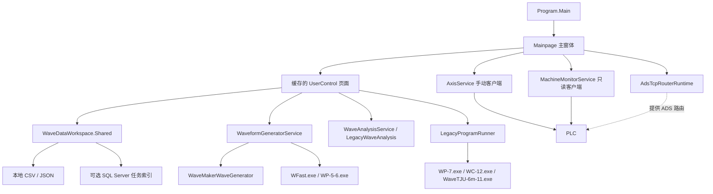

# Page switching 整个项目代码讲解

编写日期：2026-10-10。依据：本次阅读时磁盘上的项目源码，Git 基线为 `c6b678c`。

本文讲解项目的整体结构、主要调用链、每个业务源码文件的职责和关键实现，适合第一次接手项目时阅读。不是逐行复述，也不包含外部 DLL、旧计算 EXE 的内部源码。未保存到磁盘的 Visual Studio 编辑内容不属于本文依据；后续修改代码时应同步更新说明。

## 1. 这个程序做什么

这是一个基于 **.NET 8 / Windows Forms** 的造波系统上位机。主窗体提供统一导航，把多个 `UserControl` 页面放进同一个显示区域。

功能可分为三条主要流程：

| 流程 | 输入 | 处理 | 输出 |
| --- | --- | --- | --- |
| PLC 手动控制与监控 | ADS 地址、轴变量映射、按钮操作 | 读取状态，发送现有手动轴命令 | 轴位置、限位、机器状态、操作结果 |
| 浪高采集与标定 | 浪高仪 TCP 数据、已知水位 | 拆帧、原始计数转换、线性标定、记录会话 | CSV 样本、JSON 会话与标定配置 |
| 波形生成、分析与修正 | 波浪参数、实测文件、旧信号文件 | 内置计算或调用外部计算程序 | 波形文件、频谱、波浪要素、修正信号 |

当前自动运行页主要承担**只读监控**。生成波形、分析数据或修正文件，不会通过这些页面自动把造波点位发送到 PLC。

## 2. 项目结构与依赖关系

```text
Page switching/
├─ Program.cs                     程序入口
├─ Page switching.sln              Visual Studio 解决方案
├─ Page switching.csproj           编译目标、包引用、DLL 引用
├─ App.config                     默认配置和 PLC 符号映射
├─ Forms/                         主窗体
├─ panel/                         各业务页面及 Designer、RESX
├─ Axis/                          四轴手动服务、机器只读监控
├─ Infrastructure/                ADS 配置、Router、诊断、操作日志
├─ Wave/
│  ├─ Acquisition/                浪高仪通信、采集会话、标定存储
│  ├─ Generation/                 规则波和不规则波生成
│  ├─ Analysis/                   文件读取、FFT 分析、旧分析适配
│  └─ Legacy/                     旧 EXE 调用、旧信号读取
├─ Controls/                      自绘图表、位置指示、反馈表、配色
├─ lib/                           五个 InduLink DLL 及说明
└─ docs/                          接口、连接、设备背景与维护文档
```



这里的目录是代码组织方式，不是相互独立的多个项目。大部分类型位于 `Page_switching` 命名空间，一部分页面位于 `Page_switching.panel`；文件夹与命名空间不必完全对应。

### 2.1 编译配置

`Page switching.csproj` 的关键设置：

- `TargetFramework = net8.0-windows`：使用 .NET 8，目标系统是 Windows。
- `UseWindowsForms = true`：启用 WinForms。
- `OutputType = WinExe`：生成桌面程序。
- `Nullable = enable`：编译器检查可能为空的引用。
- `ImplicitUsings = enable`：部分常用命名空间由 SDK 自动导入。
- `StartupObject = Page_switching.Program`：明确启动入口。

主要包包括配置管理、SQL Server 客户端、TwinCAT ADS 与 TCP Router、JSON 和数据保护依赖。当前项目文件中的 ADS 与 Router 包版本均为 `7.0.389`；如果旧说明与项目文件不一致，构建依赖应以当前 `.csproj` 为准。

项目还直接引用 `lib` 中的五个 DLL：`InduLink.Abstractions`、`InduLink.Runtime`、`InduLink.Protocols.Ads`、`InduLink.Protocols.Ads.Router`、`InduLink.Storage`。`ValidateInduLinkLibraries` 在解析引用前检查缺失文件，并给出 `INDULINK001` 错误。关闭独立 Router 功能也不等于可以删除 Router DLL，因为代码仍引用它的类型。

## 3. 为什么一个页面有多个文件

例如手动页通常由以下文件组成：

| 文件 | 作用 | 主要维护内容 |
| --- | --- | --- |
| `manual.cs` | 页面业务逻辑 | 刷新、按钮处理、点动、错误与生命周期 |
| `manual.Designer.cs` | 静态界面初始化 | 创建控件、布局、字体、尺寸、事件绑定 |
| `manual.resx` | 设计器资源 | 控件资源、设计时元数据 |

`partial class` 表示多个文件共同定义一个类。编译时业务文件和 Designer 文件会合成完整的 `Manual` 类。

`InitializeComponent()` 创建并配置控件。构造函数先调用它，再访问控件或订阅业务事件。`SuspendLayout()` 暂停布局计算，`ResumeLayout()` 恢复，`PerformLayout()` 请求布局；设计器经常会调整这些语句的排列。

`Dock = Fill` 表示填满父容器，`Anchor` 表示窗口变化时与哪些边保持距离，`TableLayoutPanel` 管理行列布局，`FlowLayoutPanel` 按顺序排列控件。控件 `Name` 是代码身份，`Text` 是显示给用户的文字，两者用途不同。

设计器重排初始化代码或把 `new Padding(4, 4, 4, 4)` 写成 `new Padding(4)`，通常是等价序列化；删除事件绑定、改变行列比例、改动 DPI 基准或最小尺寸，则可能影响行为，不能仅凭“Designer 生成的”判断无影响。

项目共有 53 个 C# 源码文件，其中业务、服务和控件文件 39 个，Designer 文件 14 个。批量标定页有自己的 Designer，其余资源文件的存在情况以目录为准。

## 4. 从启动到关闭：主窗体如何组织程序

主要源码：[Program.cs](../Program.cs)、[Forms/main_page.cs](../Forms/main_page.cs)。

### 4.1 启动入口

```csharp
[STAThread]
static void Main()
{
    ApplicationConfiguration.Initialize();
    Application.Run(new Mainpage());
}
```

`STAThread` 为 Windows 窗体及相关组件提供所需的线程模型。`ApplicationConfiguration.Initialize()` 初始化应用级 WinForms 设置。`Application.Run()` 启动 UI 消息循环，使窗口可以响应点击、绘制和定时器事件。

### 4.2 Mainpage 构造函数

主窗体初始化顺序可以读成：

1. 创建主窗口的控件。
2. 在运行模式下登记启动日志，显示操作日志目录。
3. 合并一次 ADS 配置，创建共享 `AxisService` 和独立 `MachineMonitorService`。
4. 创建自动页、手动页、配置页，以及采集、标定、数据、波形、分析、修正页面。
5. 把页面放进 `_pages` 集合，统一用于日志注册和释放。
6. 订阅跨页面事件，例如“数据管理打开分析”“标定管理打开批量标定”。
7. 显示默认自动页，启动顶部状态定时器，登记窗口 `Shown` 事件。

`LicenseManager.UsageMode` 用来区分运行模式和设计模式。设计器打开页面时，应该以创建控件为主，避免直接启动真实设备连接。

### 4.3 真正的通信启动

窗口显示后才调用 `Mainpage_Shown()`，它保存 `_startupTask` 并执行 `StartServicesAsync()`：

```text
Router 就绪
  → _monitorReady = true
  → 发起机器监控刷新
  → 连接手动 ADS 客户端
```

监控不必等到手动客户端连接成功才开始。两条通信通路使用同一目标配置，但客户端和内部任务独立。

ADS 设置在启动时确定。配置页保存新的 Router / 连接参数后，本次已经创建的通信服务不会自动更换设置，需要重启程序。

### 4.4 顶部定时器

`_headerStatusTimer` 的间隔为 500 ms。每次 Tick：先按当前时间刷新快照有效性和顶部显示，再尝试一轮监控读取。若上轮还没结束，本轮跳过，不堆积读取任务。

处于自动页时，`includeAxes = true`，读取全局机器状态和四轴反馈；处于其他页面时，只读取五项全局状态。

### 4.5 关闭顺序

`OnFormClosing()` 首次关闭时先取消本次关闭，等待 `BeginShutdown()` 完成，然后再次 `Close()`。这样窗口清理与后台通信能够协调退出。

清理流程是：

```text
设置 closing 标志、取消生命周期令牌、停止界面定时器
  → 释放手动页，阻止继续刷新和发起按钮请求
  → 等待监控清理、实际读取任务、启动任务结束
  → 释放手动 ADS 服务
  → 最后停止独立 Router
  → 释放其余页面、日志订阅及相关资源
```

Router 放在最后，是因为此前的两个客户端仍可能需要使用它完成请求或清理。`Task.WhenAll()` 等待所有相关任务；其中一个取消，不代表其他任务已经结束。

## 5. 页面切换为什么会保留输入

所有主页面统一通过 `NavigateTo → ShowPage → panelswitch` 显示。

`ShowPage()` 的动作是：隐藏旧页面，将旧页面移出容器；把目标页面设为 `Dock.Fill`，加入 `panelswitch`，恢复可见并置于前面。

页面在主窗体启动时已经创建，切页时复用实例，不反复 `new`。因此输入内容、当前标签、已计算结果通常可以保留。

`NavigateTo()` 还负责页面切换日志、侧栏高亮、顶部页面名称以及进入自动页后的即时刷新。`SetActiveNavigation()` 修改按钮颜色和 `navigationMarker` 位置。

跨页面跳转也遵循这条链：

- `Data.AnalysisRequested`：先把采集任务交给 `WaveAnalysisPage.OpenSession()`，再进入分析页。
- `Calibration.BatchCalibrationRequested`：进入批量标定页。
- `WaveBatchCalibrationPage.BackRequested`：返回单通道标定。
- `CalibrationSaved`：刷新原标定页面，避免仍显示旧系数。

**切换到“自动运行”页面只是切换显示内容，不会向 PLC 写入自动模式。** 页面名称、实际控制端、实际运行模式分别管理。

## 6. 手动控制：页面与轴服务如何分工

源码：[panel/manual.cs](../panel/manual.cs)、[Axis/AxisService.cs](../Axis/AxisService.cs)。

### 6.1 数据类型

| 类型 | 用途 |
| --- | --- |
| `AxisSymbolMap` | 一根轴的反馈地址、命令地址 |
| `AxisServiceOptions` | AMS Net ID、端口、超时、刷新间隔、显示范围和四轴映射 |
| `AxisSnapshot` | 一根轴某轮读取结果：位置、速度、使能、回零、报警、限位、原点 |
| `AxisService` | ADS 连接、读取、写入、命令脉冲、资源释放 |

`AxisServiceOptions.FromConfiguration()` 按 `AdsAxis1...` 到 `AdsAxis4...` 的键组装四份映射。轴号是 1–4，数组下标是 0–3，代码通过 `axisNumber - 1` 转换。

### 6.2 为什么要共享 AxisService

主窗体创建一个 `AxisService`，通过 `new Manual(_axisService)` 注入手动页。手动页使用它，但不拥有它，最终由主窗体释放。

无参数的 `Manual()` 供设计器等创建场景使用，会自行创建服务；`_ownsAxisService` 区分释放责任，避免共享实例重复释放。

### 6.3 读取轴状态

手动页显示时启动自己的定时器；隐藏或从父容器移出时停止定时器，并尝试停止正在进行的点动。

读取调用链：

```text
RefreshTimer_Tick
  → RefreshValuesAsync
  → AxisService.ReadSnapshotAsync
  → ReadAdsSnapshotsAsync
  → 按顺序读取四根轴，每轴 ReadManyAsync 读取八项
  → UpdateAxisOverview / UpdateConnectionState
```

每轴八项为：位置、速度、使能、回零、报警、正限位、负限位、原点。位置和速度按 `double` 读取，状态按 `bool` 读取。某轴批量结果缺失或质量不良时，该轴显示读取失败。

状态文字按优先级生成：报警 → 限位 → 未使能 → 未回零 → 就绪。位置和速度使用可空数值；未取得有效值时显示 `--`。

### 6.4 按钮与服务方法

| 操作 | 服务方法 | 实际写入方式 |
| --- | --- | --- |
| 全部使能 | `EnableAllAsync` | 四个 EnableCommand 写 `true` |
| 全部取消使能 | `DisableAllAsync` | 四个 EnableCommand 写 `false` |
| 全部复位报警 | `ResetAlarmsAsync` | 命令置位，等待 50 ms，再复位 |
| 全部回零 | `HomeAllAsync` | 同上 |
| 全部停止 | `StopAllAsync` | 同上 |
| 选定轴回零 / 停止 | `HomeAxisAsync` / `StopAxisAsync` | 单轴命令脉冲 |
| 正向 / 负向点动 | `JogAsync` | 启动时先写速度，再写对应方向 `true`；停止写 `false` |

脉冲复位放在 `finally` 中，使用 `CancellationToken.None` 尝试复位，因此普通任务取消不会直接跳过复位步骤；通信本身失败仍可能导致复位失败，并向调用方报告。

点动使用鼠标按下和松开事件，不是一次普通 Click。页面保存启动点动时的轴号和方向，松开时清除原来那根轴的方向信号，而不是重新读取可能已变化的轴选择。

### 6.5 串行命令、停止请求和结果文字

`_operationGate = new SemaphoreSlim(1, 1)` 让服务的一次连接、读取或写入串行执行，避免共享客户端操作交错。

普通按钮通过 `RunCommandAsync()` 执行；停止按钮使用 `RunStopCommandAsync()`，不会因为普通命令正忙就拒绝新的停止请求。但停止仍进入服务现有队列，代码没有实现网络或 PLC 层面的即时抢占。

`_stopRequestVersion` 是结果显示的版本号。旧命令或旧点动较晚完成时，不能覆盖新停止请求的提示。它解决的是界面结果先后顺序，不是让已经发送的设备命令自动撤销。

`CanControlAll` / `CanControlAxis` 根据连接与配置是否齐全决定按钮可用性，不等于确认了现场轴的全部物理条件。界面显示的角度单位和 ±20 范围来自配置，不能据此认定 PLC 原始数值已经完成机械换算。

## 7. 自动页与机器只读监控

源码：[Axis/MachineMonitorService.cs](../Axis/MachineMonitorService.cs)、[Axis/MachineMonitorSnapshot.cs](../Axis/MachineMonitorSnapshot.cs)、[Axis/MachineMonitorOptions.cs](../Axis/MachineMonitorOptions.cs)、[panel/auto.cs](../panel/auto.cs)。

### 7.1 与手动服务的区别

手动服务使用 `InduLink.Protocols.Ads.AdsClient`；机器监控直接使用 `TwinCAT.Ads.AdsClient`。两者名字相同，所属命名空间和使用方式不同。

监控服务没有提供控制写入方法。它只读取反馈，并处理连接、超时、句柄缓存、心跳和数据有效性。

### 7.2 五项全局状态与四轴反馈

| 全局状态 | 默认 PLC 符号 | 当前 C# 类型 |
| --- | --- | --- |
| 控制端 | `GVL_HMI.nControlOwner` | `ushort` |
| 模式 | `GVL_HMI.nControlMode` | `ushort` |
| 造波状态 | `GVL_HMI.nWaveState` | `ushort` |
| 故障码 | `GVL_HMI.udiWaveFaultCode` | `ushort` |
| 心跳 | `GVL_HMI.udiHeartbeat` | `uint` |

故障码虽然名称带 `udi`，当前仍按 PLC 的 `UINT` / `ushort` 读取。变量名的前缀不能代替实际类型核对。

自动页显示时，每根轴还读位置、速度、回零、报警、正限位、负限位、原点，共 `5 + 4 × 7 = 33` 项。自动页不读手动服务中的使能项，不能把两条读取链的变量数量混为一谈。

控制端代码 0–3 对应未分配、上位机、现场操作台、其他控制端；模式 0–2 对应未选择、手动、自动；造波状态 0–7 对应待机、准备中、造波中、已暂停、停止中、已停止、已完成、故障。未知枚举保留数值提示，不强行解释。

### 7.3 一轮读取

```text
RefreshAsync(includeAxes)
  → 忙时跳过；失败重连间隔内跳过
  → 必要时重建客户端并读取 PLC 状态
  → ReadSnapshotAsync
  → ReadPlcAsync<T>(symbol)
  → SaveFrame
  → LatestSnapshot 检查有效性
```

`_handles` 字典缓存每个变量的 ADS 句柄。首次读取创建句柄；后续使用 `ReadAnyAsync<T>()` 直接读取。句柄失效时移除该字段缓存，下一轮重新获取；重连和退出时清理整个缓存，不能跨客户端复用。

单字段符号不存在或类型错误时，返回该字段不可用，继续读其他字段。全局质量按结果分为全部成功、部分成功或全部不可用。通信失败与接口配置错误分开处理，不能指望不断重连修复不存在的符号。

当前默认超时是：连接 10000 ms、单次 ADS 请求 1000 ms、整轮刷新 3000 ms。整轮刷新可由 `AdsMonitorRefreshTimeoutMs` 调整。调度间隔不是读取耗时保证；较慢读取时下一次调度会跳过。

### 7.4 连接成功为什么仍可能显示等待心跳

`FeedbackField<T>` 同时保存 `Value`、`IsAvailable`、`ErrorMessage`。未读到 BOOL 的含义是“未知”，不能显示成正常的 `false`。

`MachineMonitorSnapshot` 的有效性还依赖心跳：

- 首帧建立计数基线，观察到后续变化才确认机器状态实时。
- 超过默认 3 秒没有有效反馈，整份反馈过期。
- 心跳超过默认 3 秒不变化，机器全局状态不可用。
- 心跳不可用或停滞时，四轴仍按各字段读取质量显示；整体读取过期时，轴反馈也失效。

`IsConnected` 表示客户端连接；`IsLive` 还要求心跳可用及质量满足条件。连接、数据读取成功、PLC 任务持续运行是不同层次的信息。

### 7.5 自动页负责显示

`ApplyMonitorSnapshot()` 依次调用状态卡片更新、连接与心跳更新、轴表格更新和状态变化日志。

`AxisFeedbackGrid` 固定四行，自动页只更新单元格。缺失值显示 `--`，读取失败、未接入、等待心跳、心跳停滞和过期有不同文字。故障码非零会突出显示，即使造波状态枚举没有同步变为故障。

`UpdateAxisGridDpi()` 保存并使用尺寸基线，调整列宽、行高和表头；`FitAxisGridColumns()` 为位置和速度分配剩余宽度；`UpdateScrollCanvas()` 计算最小画布高度。它们是显示逻辑，不改变 PLC 数据或单位。

## 8. 浪高仪 TCP 通信与拆帧

源码：[Wave/Acquisition/WaveHeightProtocol.cs](../Wave/Acquisition/WaveHeightProtocol.cs)、[Wave/Acquisition/WaveHeightMeterClient.cs](../Wave/Acquisition/WaveHeightMeterClient.cs)、[panel/Wave_Height_Meter.cs](../panel/Wave_Height_Meter.cs)。

### 8.1 协议和传输分开

`IWaveHeightProtocol` 定义支持通道、帧头、帧长度、启动命令和解码方法。`WaveHeightMeterClient` 负责 Socket 连接、收发、缓冲、断开和事件通知。

当前实现 `LegacyChannelOneProtocol` 只支持 CH1：

- 帧头：`AA 55 55 AA`。
- 固定帧长：15 字节。
- 原始计数：`(frame[13] << 8) | frame[14]`，按两个字节合成无符号计数。
- 采样频率校验：2–50 Hz。
- 启动时发送通道设置及 start 命令，断开前尝试发送 stop 命令。

即使默认端口是 502，代码也不是通过标准 Modbus 寄存器读取浪高值，而是使用现有 JSON 命令和固定二进制帧。CH2–6 尚无确认协议，通信层和会话层都拒绝按真实采集启动它们。

### 8.2 为什么接收后还要 ExtractFrames

TCP 提供字节流，一次 `ReceiveAsync()` 不保证恰好是一帧。可能收到半帧、数帧，或不完整帧头。

`ReceiveLoopAsync()` 将收到的字节追加到 `pending`；`ExtractFrames()` 查找帧头、丢弃帧前杂字节、等待完整帧、解码后通知订阅者。如果暂时没有找到完整帧头，会保留末尾可能组成下一次帧头的字节。

启动连接及命令发送共用 5 秒超时。`SendAllAsync()` 循环发送，处理一次发送只完成部分数据的情况。`_lifecycleGate` 防止连接、断开互相交错。连接中断通过 `ConnectionLost` 事件通知页面。

### 8.3 页面怎样记录样本

```text
点击连接
  → WaveDataWorkspace.StartSession
  → WaveHeightMeterClient.ConnectAsync
  → 接收后台任务触发 SampleReceived
  → 页面 PostToUi
  → DisplaySample
  → WaveDataWorkspace.RecordRawSample
  → 更新计数、最近值和预览
```

注意：当前记录发生在页面切回 UI 线程后的 `DisplaySample()` 中，并不是 Socket 接收线程直接写 CSV。

页面预览保留最近 1000 点；完整采样记录另外写入文件。达到样本数量上限后自动断开并结束会话。清空预览不会删除本地采集记录。

没有标定时显示原始 count，有标定时显示毫米水位。保存文件失败会触发断开处理。采集页没有像手动页一样在隐藏时自动断开；页面实例被缓存，是否正在采集取决于客户端与会话状态，不能只看当前导航页面。

## 9. 采集工作区、标定与数据管理

核心源码：[Wave/Acquisition/WaveDataWorkspace.cs](../Wave/Acquisition/WaveDataWorkspace.cs)。

### 9.1 Shared 是什么

`WaveDataWorkspace.Shared` 是进程内共享工作区。浪高监测、单通道标定、批量标定和数据管理使用同一个对象，避免各自持有一套互不一致的样本与标定状态。

`_gate` 保护当前会话、写入器、最近原始值与标定字典；`_syncGate` 保护数据库同步任务。

| 数据类型 | 主要内容 |
| --- | --- |
| `WaveCalibrationPoint` | 原始计数与已知水位的一对标定数据 |
| `WaveCalibrationProfile` | 通道、零点、斜率、截距、标定点、版本 |
| `WaveSample` | 会话 ID、通道、时间、原始计数、标定值、标定版本 |
| `WaveCaptureManifest` | 采集任务信息、CSV 路径、点数、同步状态、旧文件标志 |

### 9.2 保存目录和文件

```text
%LOCALAPPDATA%/PageSwitching/
├─ AdsConnectionSettings.json
├─ Operations/yyyy-MM-dd_HH.log           默认操作日志目录，可配置
├─ WaveHeight/
│  ├─ calibrations.json
│  └─ sessions/<会话 GUID>/
│     ├─ samples.csv
│     └─ session.json
└─ WavePrograms/
   ├─ runtime/<任务 GUID>/                 旧 EXE 工作目录
   └─ analysis/<任务 GUID>/                旧分析输出
```

WFast 的临时目录另在程序目录的 `wave-runtime/<GUID>` 中。

采集 CSV 的五列为：

```csv
Timestamp,Channel,RawCount,CalibratedValue,CalibrationVersion
```

`Timestamp` 保存带时区的时间字符串；`RawCount` 和 `CalibratedValue` 允许为空。未标定的真实采集点有原始计数但没有标定水位；旧文件导入的点可能有水位但没有原始计数。

`StartSession()` 成功创建文件和会话 JSON 后才发布活动状态。`RecordRawSample()` 更新最近原始值并写样本，每 50 条刷新写入器和会话信息。`EndSession()` 关闭写入器、记录结束时间，并清除当前活动状态。

### 9.3 单通道标定

源码：[panel/Calibration.cs](../panel/Calibration.cs)。

页面选择通道、加入原始计数与真实水位、设零点、拟合、保存。没有实时数据时可以手工填写标定点，但不能凭空设定实时零点。

转换公式为：

```text
水位 = (原始计数 - ZeroRawCount) × Slope + Intercept
```

`Fit()` 用最小二乘法求直线。令 `x = RawCount - ZeroRawCount`，`y = WaterLevel`：

```text
Slope     = Σ[(x - x平均) × (y - y平均)] / Σ[(x - x平均)²]
Intercept = y平均 - Slope × x平均
```

至少需要两个点，原始值不能全部相同。拟合后生成新版本号。`GetCalibration()` 返回克隆对象，页面编辑不会立即污染共享配置；成功保存才更新工作区。

活动采集期间 `SaveProfiles()` 拒绝修改标定参数，使一段采集不在中途切换标定关系。损坏的原标定文件会先保留备份，再写入新配置。

### 9.4 批量标定

源码：[panel/WaveBatchCalibrationPage.cs](../panel/WaveBatchCalibrationPage.cs)。

每一行共享同一个已知水位，但每个通道有独立原始计数。页面先为全部选中通道计算各自系数，全部成功后再由 `SaveBatchCalibration()` 一次保存。

CH2–6 可以管理手工或历史标定数据，但不能因此认为它们具备实时设备协议。缺少真实原始值时不会拿 CH1 值填充其他通道。

旧 `.conf` 导入导出使用 COM 成对列和末行系数。导出截距为 `Intercept - ZeroRawCount × Slope`，将当前带零点的公式转换为旧文件的 `y = k × raw + b` 形式。

### 9.5 数据管理

源码：[panel/Data.cs](../panel/Data.cs)。

页面根据日期和通道筛选本地 `session.json`，通过 `Tag` 把表格行与会话对象关联。详情表显示前 2000 点，预览读取最近样本；这只是显示限制，不是采集文件容量限制。

导出全部通道时复制 CSV，导出单通道时筛选行，并保存同名 `.session.json` 侧车文件。该元信息保留采样频率等内容，供后续分析读取。

旧采集格式包含：第一行通道数、每通道点数、采样间隔；第二行通道号；其后各通道水位。导入会校验声明点数与实际行数，生成本地会话，但原始计数缺失，时间按文件间隔推算。导出旧格式要求所选通道点数一致且都有有效标定值，保留水位单位。

多通道旧文件的 `SampleCount` 是工作区记录的总样本条数，不必等于单通道时间序列长度；不要据此直接推算每通道时长。

### 9.6 SQL Server 保存什么

`SynchronizeSessionsAsync()` 在数据库启用时同步已经结束、尚未同步的会话。表名为 `dbo.WaveCaptureSessions`，字段包括会话 ID、设备地址、开始/结束时间、采样率、通道、样本条数、标定版本、CSV 路径及旧导入标志。

通过带参数的 UPDATE / INSERT 保存任务索引。逐点数据仍在 CSV，数据库不是实时控制链的一部分。单任务同步失败记录 `SyncError` 并保留待同步状态；数据库不可用不等于本地采集记录消失。

## 10. 波形生成：三个方案与三个标签页

页面源码：[panel/waveform.cs](../panel/waveform.cs)、[panel/RegularWavePage.cs](../panel/RegularWavePage.cs)、[panel/IrregularWavePage.cs](../panel/IrregularWavePage.cs)、[panel/CustomSpectrumPage.cs](../panel/CustomSpectrumPage.cs)。

规则波、不规则波子页负责控件和默认选择，通过 `GenerateRequested` / `OutputBrowseRequested` 把操作交给 `WaveformPage`。主页面收集参数、校验、控制忙状态、调用服务并显示预览。自定义谱页有自己的旧程序调用流程。

### 10.1 参数、结果和模式

`RegularWaveParameters` / `IrregularWaveParameters` 是一次生成所需参数的记录对象。`WaveformGenerationResult` 返回输出路径、样本、耗时、单位及可选的时间间隔。

`WaveformGeneratorService` 根据模式选择：

| 模式 | 实现 | 文件与含义 |
| --- | --- | --- |
| `ExternalExe` | 调用 WFast.exe | 按外部参数文件约定生成，当前服务按 m 返回预览单位 |
| `WaveMaker` | 调用内置算法 | `TimeSeconds,ElevationMetres`，水面高程，单位 m |
| `LegacyExe` | 调用 WP-5-6.exe | 旧 W3 信号，按旧造波板位移 mm 读取 |

外部文件的实际物理含义仍应按对应计算程序协议确认，不能仅凭扩展名 `.csv` 或服务默认单位判断。

模式和 WFast 路径在生成时优先读取当前配置，所以保存波形生成设置后可用于后续任务；这与已经在启动时固定配置的 ADS 服务不同。

### 10.2 内置规则波

源码：[Wave/Generation/WaveMakerWaveGenerator.cs](../Wave/Generation/WaveMakerWaveGenerator.cs)。

采样时间 `t[n] = n × TimeStep`，持续时间为 `(SampleCount - 1) × TimeStep`。

- 线性波：`η(t) = H / 2 × cos(2πt / T)`。
- 二阶 Stokes：在基波上增加二倍频项；波数由 `ω² = gk tanh(kh)` 二分求解。
- 孤立波：采用 `sech²` 形状，波峰安排在生成时段中间。
- 流函数和椭圆余弦波不在内置实现中，页面提示选择旧方案。

这些计算返回的是水面高程。代码尚未实现“目标高程 → 摇板摆角 → 丝杆位置 → PLC 点位”的设备转换。

### 10.3 内置不规则波

将周期范围转换为频率范围，分成 512 个分量；每个分量振幅为 `sqrt(2 × S(f) × Δf)`，相位来自固定种子的 `SplitMix64` 伪随机序列，最后叠加所有余弦分量。

当前内置方案只支持单向线性不规则波。支持的谱选择包括 JONSWAP、B 谱、P-M 和 ITTC；B 谱与 P-M 代码入口在这里共用 Bretschneider 形式。JONSWAP 用数值积分做目标波高能量归一化。

固定随机种子使同样输入能够重现同一计算序列。它不意味着生成信号会逐时刻复现某份实测水面记录，因为实测相位和设备传递关系并未由此保留。

### 10.4 WFast 与旧规则 / 不规则波程序

WFast 调用流程：建立独立临时目录 → 复制支持 CSV → 写 `BasicParameters.dat` → 后台启动 EXE → 读取输出和错误 → 等待退出 → 检查输出 → 读取样本 → 清理临时目录。

WFast 超时为 2 分钟，取消或超时会尝试终止进程树。`WaveformCsvReader` 从每行提取最后一个可解析数值作预览样本，不是完整的通用 CSV 协议验证器。

旧 WP-5-6 使用旧参数顺序和 W3 输出，通过 `LegacyProgramRunner` 执行，读取 `LegacyWaveSignal` 后按 mm 返回。旧生成入口限制最多 131072 点；页面接受范围与各生成器实际能力不是同一层限制。

### 10.5 自定义谱

`CustomSpectrumPage.ReadSpectrum()` 跳过表头，读取频率 / 谱密度两列，要求频率非负且严格递增、谱密度非负。

生成时复制输入谱到任务目录，写 `BasicParameters_user.dat`，调用 `WP-7.exe`，把结果按旧位移格式读取并绘图。输出路径不能覆盖输入谱。该标签不通过内置随机谱服务生成，也没有在这里向 PLC 下发点位。

## 11. 波浪分析：文件怎样变成频谱和波浪要素

源码：[panel/WaveAnalysisPage.cs](../panel/WaveAnalysisPage.cs)、[Wave/Analysis/WaveSeriesFile.cs](../Wave/Analysis/WaveSeriesFile.cs)、[Wave/Analysis/WaveAnalysisService.cs](../Wave/Analysis/WaveAnalysisService.cs)、[Wave/Analysis/LegacyWaveAnalysis.cs](../Wave/Analysis/LegacyWaveAnalysis.cs)。

### 11.1 统一输入 WaveSeries

`WaveSeries` 包含三个核心信息：数值数组 `Values`、等间隔时间步长 `Interval`、通道号 `Channel`。

`WaveSeriesFile.Read()` 识别三类输入：

1. 当前采集 CSV：读取指定通道的 `CalibratedValue`，优先采用会话中的采样频率。
2. 内置生成 CSV：按 `TimeSeconds,ElevationMetres` 读取单列水面高程。
3. 旧采集 TXT / DAT：读取声明的通道、点数和间隔，由界面选择旧水位单位。

分析统一使用米。当前真实采集标定水位按毫米转米；旧导入记录按单位选项处理；内置高程 CSV 已经是米。原始计数没有标定时拒绝当作真实波高分析。

有会话采样率时，使用固定间隔 `1 / Hz`，避免把成批 TCP 收包时间当成设备采样间隔。需要从时间列推算时，检查时间严格递增及间隔偏差，拒绝明显不均匀序列。

### 11.2 内置分析步骤

```text
读取选定通道
  → 取不超过样本数的最大 2 的幂个点
  → 去均值
  → Hann 加窗
  → 基 2 FFT
  → 按窗能量归一化为单边谱
  → 可选移动平均光滑并保持离散谱总能量
  → 生成理论谱
  → 上跨零识别完整波
  → 输出频谱矩和波浪统计
```

至少要求 64 点，单次最多支持 4194304 点。不是对不足 2 的幂的输入补零，而是截取前面最大 2 的幂长度；页面显示实际使用点数。

频率间隔 `Δf = 1 / (N × Δt)`。谱能量按 Hann 窗平方和归一化，除直流和 Nyquist 外的正频率项乘 2 得到单边谱，直流项设为零。

光滑次数允许 0–20，光滑点数为 1–101 的奇数。前缀和加快窗口求和，光滑后按总谱值比例归一化。

### 11.3 输出统计的含义

| 指标 | 当前计算含义 |
| --- | --- |
| `Hm0` | `4 × sqrt(m0)`，谱有效波高 |
| `Tp` | 实测谱峰频率的倒数 |
| `Tm01` | `m0 / m1` |
| `Tm02` | `sqrt(m0 / m2)` |
| `Hmax / Hmin / H_ave` | 完整上跨零波的最大、最小、平均波高 |
| `H1/3 / H1/10 / H1/100` | 按波高从大到小排序后，最高对应比例波的平均波高 |
| `TH...` | 与相应按波高选出的波组对应的平均周期 |

`mr = Σ[S(fi) × fi^r × Δf]` 是 r 阶谱矩。上跨零方法根据相邻上跨零点构成一个完整波，周期来自插值后的过零时间，波高为区间最大值减最小值。没有完整波时相应统计为 NaN，界面显示“无完整波”。

当前内置理论谱为深水谱模型，分析页面的水深参数仅记录，不参与浅水修正。旧 EXE 与内置结果的等价性没有由这些源码本身证明。

### 11.4 旧分析与导出

旧分析调用 `WaveTJU-6m-11.exe`，参数文件名为 `SpecAnaParamaters.dat`，要求至少 64 点且样本数是 2 的幂。也可以直接导入旧 `Spectra.dat` 与 `WaveParameters.dat` 结果。

分析页导出频谱或要素，并附带 `.json` 元数据记录来源、通道、单位、采样率、参数、方法及使用点数。输入参数变化会清除旧结果，避免导出与当前输入不匹配的计算结果。导出不能覆盖原采集文件。

## 12. 信号修正与旧计算程序适配

源码：[panel/SignalCorrectionPage.cs](../panel/SignalCorrectionPage.cs)、[Wave/Legacy/LegacyWaveSignal.cs](../Wave/Legacy/LegacyWaveSignal.cs)、[Wave/Legacy/LegacyProgramRunner.cs](../Wave/Legacy/LegacyProgramRunner.cs)、[Wave/Legacy/WaveProgramSettings.cs](../Wave/Legacy/WaveProgramSettings.cs)。

### 12.1 LegacyWaveSignal

旧信号结构为：一行表头、八行元信息，再加声明数量的位移数据行。解析器检查样本数、时间步长和行数，并读取位移、可选吸收列、深度、周期、波高、波型、谱型等信息。

旧位移按 mm 处理。包含 `ElevationMetres` 的水面高程文件会被明确拒绝，不能作为旧板位移信号读取。

### 12.2 修正流程

```text
原造波板位移文件 + 指定通道实测文件
  → 校验原信号与实测序列
  → 将实测值整理为旧程序所需单位和单通道格式
  → 写 SigCorParamaters.dat
  → 调用 WC-12.exe
  → 校验并发布新输出
  → 对比原信号与修正信号
```

实测数据要求至少 64 点且为 2 的幂，光滑点数为奇数。输出必须区别于原信号和实测文件。对比要求新旧信号的点数、时间步长一致，否则不强行按同一时间轴绘图。

代码只实现参数传递、文件转换、调用和结果读取。WC-12 内部如何求修正关系，必须查其源码或验收样例，不能把文件调用包装解释成已经具备在线闭环控制。

### 12.3 LegacyProgramRunner

这是 WP-5-6、WP-7、WC-12、旧分析共用的执行包装：为每个任务创建独立目录、复制支持 DLL / DAT / CSV、用代码页 936 写参数文件，运行程序并捕获输出。

默认超时 3 分钟；超时或取消终止进程。先删除工作目录中可能来自旧任务的 `output.csv`，避免把旧文件当本次结果。先解析验证输出，再复制到目标临时文件并替换目标，尽量避免损坏输出直接覆盖用户文件。

旧程序任务目录保留在 `WavePrograms/runtime` 下，可用于追查参数与输出；不能和 WFast 任务完成后尝试清理临时目录的行为混同。

`WaveProgramSettings.ProgramDirectory` 优先读取配置目录；未配置时尝试旧桌面目录作为兼容路径。部署到另一台电脑时应在配置页明确选择有效目录。

## 13. 配置、Router、诊断与日志

### 13.1 配置不是全部写回同一个地方

| 配置类别 | 默认来源 / 保存位置 | 生效方式 |
| --- | --- | --- |
| ADS 目标与独立 Router | 默认 App.config，用户保存到 `AdsConnectionSettings.json` | 重启后应用给通信服务 |
| 四轴符号和监控符号 | App.config | 本次启动构建服务时读取 |
| 波形方案、EXE 路径、旧程序目录 | 运行程序的配置文件 | 刷新配置节后用于后续生成任务 |
| 浪高仪连接与采集参数 | 运行程序的配置文件 | 用于后续连接及下次加载 |
| 数据库连接、开关 | 运行程序的配置文件 | 后续同步读取 |
| 操作日志目录 | 运行程序的配置文件 | 保存后后续日志使用新目录 |
| 标定参数 | WaveHeight/calibrations.json | 成功保存后工作区更新 |

`ConfigurationManager.OpenExeConfiguration()` 保存的是正在运行的应用配置文件，不是直接编辑源码目录里的 `App.config`。程序重新构建或部署时，要区分默认配置与运行配置。

`AdsConnectionSettings` 仅允许固定的连接键，保存到用户目录，覆盖默认配置并在进程内缓存。它不用于保存标定、数据库设置或机械参数。

### 13.2 独立 Router

`AdsTcpRouterRuntime.StartAsync()` 先记录配置及 SDK 版本。关闭独立 Router 时使用系统 TwinCAT Router；启用时创建 `AdsTcpRouterHost`，等待其进入运行状态。

代码在创建两个 ADS 客户端连接之前设置回环端点及通道类型，以使用指定 Router。Router 启动失败向主窗体报告，不自动改连另一套本机 Router。ADS 端口、TCP 路由端口、远端 IP 和 AMS Net ID 是不同参数；Net ID 是六段数字身份，不能直接视为 IP 地址。

### 13.3 日志分工

`OperationJournal.Record(page, message)` 写入时间、页面类别和消息。默认每小时一个 `yyyy-MM-dd_HH.log` 文件，文件锁防止多个任务同时追加互相干扰。日志目录可以使用绝对路径、相对程序目录路径及环境变量。

主窗体 `TrackActions()` 递归订阅按钮、选择框、标签页等操作；部分旧页面通过结果标签变化记录结果。已经明确调用日志入口的页面会避开部分重复捕获。

`EntryAdded` 在当前主窗体主要用于更新日志保存位置，不是把所有日志绘成主窗体历史列表。自动页另有自己的消息列表，最多保留 500 条；它的 `AddLog()` 同时写统一操作日志。

`AdsDiagnostics` 将通信异常转换为适合日志定位的描述。旧 `InduLink.Storage.LogDisplayHelper` 仍在部分协议诊断和退出处理使用，完整内部实现不在本项目源码里。

## 14. 自定义控件怎么显示数据

| 控件文件 | 作用 | 关键方法 |
| --- | --- | --- |
| [UiPalette.cs](../Controls/UiPalette.cs) | 统一背景、文字、按钮、成功/警告/错误颜色 | 静态颜色字段 |
| [ServoPositionIndicator.cs](../Controls/ServoPositionIndicator.cs) | 绘制单轴位置、刻度和状态 | `Update()`、`OnPaint()`、`MapPosition()` |
| [WaveformPreviewControl.cs](../Controls/WaveformPreviewControl.cs) | 单条时间波形预览 | `SetSamples()`、`ClearSamples()`、`OnPaint()` |
| [ComparisonPlotControl.cs](../Controls/ComparisonPlotControl.cs) | 双曲线对比：频谱或新旧位移 | `SetSeries()`、`OnPaint()` |
| [AxisFeedbackGrid.cs](../Controls/AxisFeedbackGrid.cs) | 自动页固定四轴表格 | `InitializeRows()` |

这些控件继承 WinForms 控件，通过 `OnPaint()` 使用 GDI+ 绘制，`Invalidate()` 请求重绘，双缓冲降低闪烁。

`WaveformPreviewControl` 保存样本副本，根据时间步长计算横轴，超过较多点时按 stride 抽样绘制约 4000 个点，因此预览可能跳过短尖峰。`ComparisonPlotControl` 则按像素保留分段最小和最大值，减少长记录尖峰丢失。两种图都是显示，不改变保存文件中的全部数据。

`AxisFeedbackGrid.InitializeRows()` 只有列数为八且当前无行时才增加四条占位行，设计器和运行时重复调用不会重复增加轴行。列定义和样式仍在 `auto.Designer.cs`。

## 15. 贯穿项目的 C# 写法

| 写法 | 在这个项目中的含义 |
| --- | --- |
| `async / await` | 等待通信、文件任务或 EXE 结束，避免长时间同步占用 UI |
| `async void` | 主要用于 WinForms 事件；一般业务任务使用可等待的 `Task` |
| `CancellationToken` | 通知启动、读取、生成等任务退出；不是强行杀线程 |
| `SemaphoreSlim` | 限制同一服务或同步流程一次只有一个操作 |
| `lock` | 保护共享状态和本地数据的短临界区 |
| `BeginInvoke` | 将后台通知安排到控件所属 UI 线程 |
| `ConfigureAwait(false)` | 服务层后续不依赖 UI 上下文；调用方仍可回 UI 更新 |
| `event` | 页面向主窗体发请求，客户端向页面发样本或断线通知 |
| `record` / `with` | 表达参数与快照，派生新值而不是随处修改同一个对象 |
| `using` / `Dispose` | 释放文件、Socket、进程、定时器、组件等资源 |
| `try / finally` | 无论成功、异常还是取消，都恢复按钮状态、释放门锁或尝试复位 |

不要把 `async` 理解为“所有内容自动在后台线程执行”。Socket 接收明确使用后台任务，内置波形与 FFT 计算也使用 `Task.Run()`；其他方法的具体执行线程由调用上下文与 await 决定。

UI 更新前常检查 `IsDisposed`、`Disposing`、`IsHandleCreated` 和关闭标志，防止窗口释放后仍访问控件。订阅共享对象事件的页面还需要取消订阅，否则共享对象可能继续引用已关闭页面。

## 16. 建议的阅读与调试顺序

### 16.1 第一次读代码

1. `Program.cs`：确认入口。
2. `Forms/main_page.cs`：看构造函数、`NavigateTo()`、`StartServicesAsync()`、关闭流程。
3. `manual.cs → AxisService.cs`：理解页面和设备服务的边界。
4. `MachineMonitorOptions → MachineMonitorSnapshot → MachineMonitorService → auto.cs`：理解状态与有效性。
5. `WaveHeightProtocol → WaveHeightMeterClient → Wave_Height_Meter → WaveDataWorkspace`：理解一条数据从设备到文件的路径。
6. `Calibration / WaveBatchCalibrationPage / Data`：看标定、任务浏览与同步。
7. `waveform.cs → WaveformGeneratorService → WaveMakerWaveGenerator`：看生成模式和算法。
8. `WaveSeriesFile → WaveAnalysisService → WaveAnalysisPage`：看单位、FFT、统计和导出。
9. `LegacyProgramRunner / LegacyWaveSignal / SignalCorrectionPage`：看旧程序适配。
10. 回到各 Designer 文件，将业务里的控件名与界面对应。

### 16.2 常用断点位置

| 想追查的问题 | 首先看哪里 | 观察内容 |
| --- | --- | --- |
| 切页或高亮异常 | `NavigateTo / ShowPage` | `_currentPage`、目标页、容器子控件 |
| ADS 启动失败 | `StartServicesAsync / AdsTcpRouterRuntime.StartAsync` | 阶段、目标、Router 状态、异常 |
| 手动某轴读不到 | `AxisService.ReadAxisAsync` | 八个符号、批量质量、实际返回值 |
| 停止按钮结果被覆盖 | `RunStopCommandAsync / CanUpdateCommandStatus` | `_stopRequestVersion`、请求版本 |
| 自动页某变量失败 | `MachineMonitorService.ReadPlcAsync<T>` | `symbol`、`typeof(T)`、句柄、ErrorCode |
| 有值但显示等待或过期 | `SaveFrame / LatestSnapshot` | 心跳变化、最近成功时间、OverallQuality |
| 浪高仪有字节但无样本 | `ExtractFrames / TryDecodeFrame` | pending、帧头、帧长、计数字节 |
| 采集显示未标定 | `RecordRawSample / GetCalibration` | 通道、profile、CalibratedValue |
| 生成 EXE 没有输出 | `GenerateAsync / LegacyProgramRunner.RunAsync` | 工作目录、参数文件、退出码、输出文件 |
| 波浪分析数值异常 | `WaveSeriesFile.Read / WaveAnalysisService.Analyze` | 单位、Interval、使用点数、谱能量 |

调试 PLC 读取时应运行最新 Debug 构建并使用对应 PDB。长时间停在断点会使超时或过期判断生效，继续运行后需要等待新的有效读取。

### 16.3 构建与验证边界

在项目目录执行：

```powershell
dotnet restore "Page switching.sln"
dotnet build "Page switching.sln" -c Debug
dotnet build "Page switching.sln" -c Release
```

构建需要 Windows / .NET SDK 及 `lib` 中匹配的五个 DLL。编译成功说明类型、引用及资源可以生成，不代表现场符号、传感器协议、机械单位和波形效果已经验证。

当前目录没有随项目保存的独立测试工程。历史验证见既有文档，其中的历史断言数量不应当作本次文档编写重新执行的结果。阅读和编写本文没有启动真实 PLC、采集设备或旧 EXE。

## 17. 全部业务源码文件索引

以下列出全部 39 个非 Designer C# 文件。配套的 14 个 Designer 文件主要定义静态界面，按第 3 节的方法阅读即可。

### 17.1 入口与主窗体（2 个）

| 文件 | 职责 |
| --- | --- |
| [Program.cs](../Program.cs) | 初始化 WinForms，运行主窗体 |
| [Forms/main_page.cs](../Forms/main_page.cs) | 页面缓存与导航、服务启动关闭、顶部状态、操作追踪 |

### 17.2 PLC 轴与监控（4 个）

| 文件 | 职责 |
| --- | --- |
| [Axis/AxisService.cs](../Axis/AxisService.cs) | 轴快照、轴符号、服务选项及手动 ADS 服务 |
| [Axis/MachineMonitorOptions.cs](../Axis/MachineMonitorOptions.cs) | 只读监控目标、地址和超时 |
| [Axis/MachineMonitorSnapshot.cs](../Axis/MachineMonitorSnapshot.cs) | 字段有效性、轴与机器快照、质量状态 |
| [Axis/MachineMonitorService.cs](../Axis/MachineMonitorService.cs) | 逐字段读取、句柄缓存、心跳、过期、重连与释放 |

### 17.3 基础设施（4 个）

| 文件 | 职责 |
| --- | --- |
| [Infrastructure/AdsConnectionSettings.cs](../Infrastructure/AdsConnectionSettings.cs) | 默认与用户 ADS 配置合并、保存、缓存 |
| [Infrastructure/AdsTcpRouterRuntime.cs](../Infrastructure/AdsTcpRouterRuntime.cs) | 可选独立 Router 的配置、启动和停止 |
| [Infrastructure/AdsDiagnostics.cs](../Infrastructure/AdsDiagnostics.cs) | ADS 异常描述与诊断记录 |
| [Infrastructure/OperationJournal.cs](../Infrastructure/OperationJournal.cs) | 统一操作日志、目录解析、写入通知 |

### 17.4 浪高采集（3 个）

| 文件 | 职责 |
| --- | --- |
| [Wave/Acquisition/WaveHeightProtocol.cs](../Wave/Acquisition/WaveHeightProtocol.cs) | 协议接口与当前 CH1 解码 |
| [Wave/Acquisition/WaveHeightMeterClient.cs](../Wave/Acquisition/WaveHeightMeterClient.cs) | TCP 连接、拆帧、样本与断线事件 |
| [Wave/Acquisition/WaveDataWorkspace.cs](../Wave/Acquisition/WaveDataWorkspace.cs) | 标定、采集会话、文件、旧格式和数据库索引 |

### 17.5 生成、分析与旧程序（8 个）

| 文件 | 职责 |
| --- | --- |
| [Wave/Generation/WaveformGeneratorService.cs](../Wave/Generation/WaveformGeneratorService.cs) | 参数与结果类型、模式分派、WFast / 旧生成调用、通用预览读取 |
| [Wave/Generation/WaveMakerWaveGenerator.cs](../Wave/Generation/WaveMakerWaveGenerator.cs) | 内置规则波、随机谱波、谱函数与高程 CSV |
| [Wave/Analysis/WaveSeriesFile.cs](../Wave/Analysis/WaveSeriesFile.cs) | 序列格式、单位、时间间隔及旧采集写出 |
| [Wave/Analysis/WaveAnalysisService.cs](../Wave/Analysis/WaveAnalysisService.cs) | FFT、单边谱、光滑、过零与统计 |
| [Wave/Analysis/LegacyWaveAnalysis.cs](../Wave/Analysis/LegacyWaveAnalysis.cs) | 旧分析 EXE 调用与旧结果读取 |
| [Wave/Legacy/LegacyProgramRunner.cs](../Wave/Legacy/LegacyProgramRunner.cs) | 共用的旧 EXE 任务包装 |
| [Wave/Legacy/LegacyWaveSignal.cs](../Wave/Legacy/LegacyWaveSignal.cs) | 旧造波板位移及可选吸收数据读取 |
| [Wave/Legacy/WaveProgramSettings.cs](../Wave/Legacy/WaveProgramSettings.cs) | 旧程序目录与任务工作目录 |

### 17.6 页面（13 个）

| 文件 / 类 | 职责 |
| --- | --- |
| [panel/auto.cs](../panel/auto.cs) / `Auto` | 自动页快照显示、状态格式化、消息与布局 |
| [panel/manual.cs](../panel/manual.cs) / `Manual` | 手动轴按钮、点动、刷新和结果提示 |
| [panel/config.cs](../panel/config.cs) / `Config` | Router、波形、数据库及操作日志配置 |
| [panel/Wave_Height_Meter.cs](../panel/Wave_Height_Meter.cs) | 连接采集、样本记录、预览、停止和导出 |
| [panel/Calibration.cs](../panel/Calibration.cs) | 单通道标定、零点、旧 CONF 导入导出 |
| [panel/WaveBatchCalibrationPage.cs](../panel/WaveBatchCalibrationPage.cs) | 共同水位、多通道独立拟合与整体保存 |
| [panel/Data.cs](../panel/Data.cs) | 本地采集记录筛选、查看、导入导出和同步 |
| [panel/waveform.cs](../panel/waveform.cs) / `WaveformPage` | 规则 / 不规则生成的统一参数和任务管理 |
| [panel/RegularWavePage.cs](../panel/RegularWavePage.cs) | 规则波控件、默认选择和操作事件 |
| [panel/IrregularWavePage.cs](../panel/IrregularWavePage.cs) | 不规则波控件、默认选择和操作事件 |
| [panel/CustomSpectrumPage.cs](../panel/CustomSpectrumPage.cs) | 自定义谱读取、预览及 WP-7 调用 |
| [panel/WaveAnalysisPage.cs](../panel/WaveAnalysisPage.cs) | 分析参数、方法选择、图表、统计和导出 |
| [panel/SignalCorrectionPage.cs](../panel/SignalCorrectionPage.cs) | WC-12 修正、文件保护及新旧信号对比 |

### 17.7 控件（5 个）

| 文件 | 职责 |
| --- | --- |
| [Controls/UiPalette.cs](../Controls/UiPalette.cs) | 公共配色 |
| [Controls/ServoPositionIndicator.cs](../Controls/ServoPositionIndicator.cs) | 轴位置自绘 |
| [Controls/WaveformPreviewControl.cs](../Controls/WaveformPreviewControl.cs) | 单曲线波形自绘 |
| [Controls/ComparisonPlotControl.cs](../Controls/ComparisonPlotControl.cs) | 双曲线自绘 |
| [Controls/AxisFeedbackGrid.cs](../Controls/AxisFeedbackGrid.cs) | 固定四轴占位行 |

## 18. 维护前需要了解的实际边界

1. 自动页是反馈显示，当前没有自动造波点位下发链。手动命令成功发送，也不等于设备已完成对应动作。
2. 设备按摇板式、上方丝杆驱动理解；铰链位置、连接尺寸、轴单位和完整转换关系仍待确认。内置水面高程、旧位移、板角度、丝杆位移、电机角度不能相互直接替代。
3. 资料中的铰链到板顶初步高度 1.5 m 不等于水深或已确认力臂，板 ±20° 也不等于电机角度或丝杆行程。
4. CH2–6 的标定与历史文件管理不等于真实多通道采集已经接入。真实协议仍只实现 CH1。
5. 外部 EXE 的结果兼容性和实际效果需要样例及现场验收；本项目源码只覆盖调用接口和文件处理。
6. UI 定时器、任务队列和软件停止按钮不是 PLC 扫描周期或设备停止时延保证。
7. 修改页面时保留 Designer 可编辑，新增主页面沿用统一导航；关键操作结果明确记录，避免依赖多个重复标签监听。

相关背景文档：

- [造波计算讨论记录](WaveGenerationNotes.md)：水面目标、机构换算与设备资料。
- [PLC 只读监控接口](PlcMonitoringContract.md)：全局状态、类型、心跳与现场读取记录；部分早期时序描述需结合后续记录及当前源码阅读。
- [ADS 连接说明](AdsConnectionGuide.md)：两台电脑、系统 / 独立 Router 和回程路由。
- [代码简化说明](CodeSimplification.md)：当前读取调用链与断点位置。
- [旧工程功能覆盖](旧工程功能覆盖.md)：迁移页面与旧程序兼容范围。
- [内部 DLL 说明](../lib/README.md)：依赖文件来源；具体包版本以当前项目文件为准。

后续查问题时，先确定属于页面显示、设备通信、数据文件还是算法处理，再沿对应调用链定位。这样可以避免用界面布局修改去处理协议问题，也避免把原始计数、历史反馈或水面高程当作已经确认的设备运动数据。
